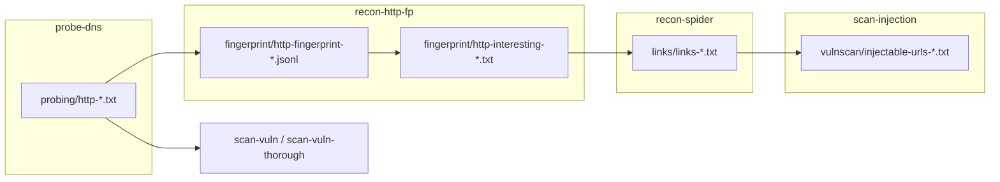

# AGENTS.md — Osmedeus Workflow Guide for AI Agents

This document helps AI agents **debug failed runs**, **trace data between modules**, and **write new workflows** in this repository. For full Osmedeus engine reference, also use the `osmedeus-expert` skill.

## Mental Model

Osmedeus runs YAML workflows in two layers:

| Kind | File location | Role |
|------|---------------|------|
| **flow** | `*.yaml` at repo root | Orchestrates modules via `depends_on` |
| **module** | `common/*.yaml`, `fragments/*.yaml` | Executes ordered **steps** (bash, function, foreach, …) |

```
Target + params → flow → modules (DAG) → steps → artifacts under {{Output}}
```

**Built-in variables** (always available): `{{Target}}`, `{{Output}}`, `{{TargetSpace}}`, `{{Workspaces}}`, `{{RunUUID}}`, `{{threads}}`.

**Foreach** loop variables use `[[variable]]`, not `{{variable}}`.

## Repository Layout

```
common/       # Full recon modules (multi-host, workspace-scoped paths)
fragments/    # Single-target variants (do-*) for url/web-analysis flows
events/       # Event-driven workflows
*.yaml        # Flow definitions (general, domain-extensive, url, cidr, …)
```

| Pattern | When to use |
|---------|-------------|
| `common/<module>.yaml` | Domain/CIDR flows; reads `probing/http-{{TargetSpace}}.txt`, etc. |
| `fragments/do-<module>.yaml` | URL/single-host flows; often takes `{{Target}}` directly |
| `extends: parent-flow` | Override params/modules without duplicating the whole flow |

**Rule:** Before adding logic, search `common/` and `fragments/` for an existing step to extend. Prefer module-level `params` defaults over flow-only params.

## Standard Recon Pipeline (Domain Flows)

Phases and artifact dependencies:

```
enum-subdomain
  → subdomain/subdomain-{{TargetSpace}}.txt
probe-dns
  → probing/dns-*.txt, probing/http-*.txt
recon-http-fp
  → fingerprint/http-fingerprint-*.jsonl
  → fingerprint/http-interesting-*.txt        ← spider input
recon-spider (parallel with scan-vuln, scan-content, …)
  → links/links-*.txt
scan-content
  → content-discovery/content-discovery-url-*.txt
scan-injection (depends on recon-spider)
  → vulnscan/injectable-urls-*.txt, sqlmap/dalfox output
scan-vuln
  → vulnscan/nuclei-*.txt (host roots from probing/http-*.txt)
scan-vuln-thorough
  → vigolium deep scan on host roots
```



### Scanning scope (common pitfall)

| Module | Input | Finds |
|--------|-------|-------|
| `scan-vuln` | `probing/http-*.txt` | Nuclei on **host roots** |
| `scan-vuln-thorough` | host roots | Vigolium modules (may miss blind SQLi) |
| `scan-injection` | spider + content-discovery URLs with `?` | sqlmap, dalfox |

Parameterized URLs from Katana only reach injection scanning if `recon-spider` produced links.

## Params and Inheritance

Flow params override module defaults. Child flows use `extends`:

```yaml
# domain-extensive.yaml
extends: domain-standard
params:
  - name: enableDnsBruteFocing
    default: true
  - name: enableStoreHTTPResponse
    default: true
```

**Critical:** Any `{{param}}` used in a module `pre_condition` must be defined either:

1. In the **module** `params:` (preferred — safe default), or  
2. In every **flow** that uses the module.

Undefined params render as empty strings → JS `pre_condition` **SyntaxError** → step skipped silently after log error.

Example (fixed in `common/recon-http-fp.yaml`):

```yaml
params:
  - name: enableStoreHTTPResponse
    type: bool
    default: false
```

### Important toggles

| Param | Default (typical) | Effect when false |
|-------|-------------------|-------------------|
| `enableDnsBruteFocing` | `false` in `probe-dns`, `true` in `domain-extensive` | Skips `dns-bruteforce` |
| `enablePermutation` | `false` | Skips `generate-permutations` |
| `enableSYNScan` | `false` | Skips entire rustscan/nmap chain |
| `enable_amass` | `false` | Skips `amass-enum` |
| `skipSpidering` | `false` | When `"true"`, spider module calls `skip()` |

CLI override: `-p 'enableDnsBruteFocing=true' -p 'enableSYNScan=true'`

## Step Types Used Here

| Type | Used for |
|------|----------|
| `bash` | External tools (subfinder, nuclei, sqlmap, katana, …) |
| `function` | Osmedeus JS helpers (`sort_unix`, `jsonl_filter`, `db_import_*`, `create_folder`) |
| `foreach` | Per-host katana, ffuf, vigolium (`input` file, `variable: line`, `threads`) |
| `parallel-steps` | Rare in this repo |

Common step fields:

```yaml
- name: my-step
  type: bash
  pre_condition: 'file_exists("{{httpFile}}")'   # skip if false — NOT an error
  log: "Human-readable status"
  command: 'tool -u {{Target}} -o {{Output}}/out.txt'
  on_error:
    - action: continue
  exports:
    myVar: "{{Output}}/out.txt"
```

`pre_condition: false` → step shows as **skipped** (◌).  
`pre_condition` **evaluation error** → step shows as **failed pre-condition** (⏹) — treat as a bug.

Guard steps that call `skip()` abort the **current module** when a limit is hit:

```yaml
# recon-spider.yaml
- name: check-input-limit
  pre_condition: 'file_length("{{httpFile}}") > {{spiderLimit}}'
  functions:
    - 'log_error("Filter", "Got input file greater than {{spiderLimit}} line")'
    - "skip()"
```

## Debugging Playbook

### 1. Identify what actually ran

```bash
osmedeus query runs --target example.com
osmedeus query steps --run <run-uuid>
```

Or via MCP (`osmedeus_runs_get` with `include_steps: true`, `osmedeus_artifacts_read`).

Read `run-console.log` in the workspace. Look for:

- `★ Executing: <module>` — modules that started
- `◌ <step> (skipped)` — pre_condition false (often expected)
- `⏹ <step>: pre-condition evaluation failed` — **bug** (undefined param, bad JS)
- `✔` / `▶` — step ran

### 2. Classify skipped steps

| Category | Meaning | Action |
|----------|---------|--------|
| **Expected** | Toggle off (`enableSYNScan`, `enable_amass`) or fallback not needed | None, or pass `-p` if you want the step |
| **Empty input** | Upstream artifact missing/empty | Trace upstream module |
| **SyntaxError in pre_condition** | Missing param default | Add module param default |
| **Stale workspace** | Old artifact satisfies `file_exists` but content is wrong | Clean workspace or delete artifact dir |

### 3. Trace upstream artifacts

For a symptom, check files in order:

| Symptom | Check these files |
|---------|-------------------|
| Spider finished in &lt;1s, 0 links | `fingerprint/http-interesting-*.txt`, `probing/http-*.txt` |
| Injection did nothing | `links/links-*.txt`, `content-discovery/content-discovery-url-*.txt`, `vulnscan/injectable-urls-*.txt` |
| No DNS bruteforce results | run params / `enableDnsBruteFocing`, `TargetIsWildcard` |
| No port scan | `enableSYNScan`, `ipspace/*-ip.txt` |
| Nuclei findings but no SQLi | Expected — use `scan-injection` on crawled URLs |

Workspace path: `{{Workspaces}}/{{TargetSpace}}/` (or MCP workspace name).

### 4. Validate before run

```bash
osmedeus workflow lint common/my-module.yaml
osmedeus workflow lint domain-extensive.yaml
osmedeus run -f domain-extensive -t example.com --dry-run
```

### 5. Server vs local repo

Workflows on a remote Osmedeus server live under `/root/osmedeus-base/workflows/`. If local `domain-extensive.yaml` has 12 modules but the server index shows 10, **deploy/sync** before expecting new modules (`scan-injection`, `scan-vuln-thorough`) to run.

## Writing a New Module

Minimal checklist:

1. **Name** — `kind: module`, unique `name`, `description`, `tags`
2. **Params** — every template var in steps; use `type: bool` for toggles; sensible defaults
3. **Dependencies** — `commands:` list binaries; `variables: Target`
4. **Reports** — `reports:` for outputs users query later
5. **Steps** — setup folder → produce/consume files → DB import / summary
6. **pre_condition** — guard expensive steps; use `file_length(...) > 0` not just `file_exists` when empty files matter
7. **on_error: continue** — for non-fatal tool failures (common pattern here)

```yaml
kind: module
name: my-scanner
description: One-line purpose

params:
  - name: inputFile
    default: "{{Output}}/probing/http-{{TargetSpace}}.txt"
  - name: myLimit
    default: "500"

dependencies:
  commands:
    - some-tool
  variables:
    - name: Target
      type: string
      required: true

reports:
  - name: results
    path: "{{Output}}/my-module/results-{{TargetSpace}}.txt"
    type: text

steps:
  - name: create-output-folder
    type: function
    functions:
      - 'create_folder("{{Output}}/my-module")'

  - name: run-scanner
    type: bash
    pre_condition: 'file_length("{{inputFile}}") > 0'
    command: 'some-tool -l {{inputFile}} -o {{Output}}/my-module/results-{{TargetSpace}}.txt'
    on_error:
      - action: continue
```

## Wiring a New Module into a Flow

```yaml
# In general.yaml or domain-extensive.yaml
  - name: my-scanner
    path: common/my-scanner.yaml
    depends_on:
      - recon-spider   # wait for inputs you need
```

For single-URL flows, add a `fragments/do-my-scanner.yaml` and reference it from `url.yaml`.

**Dependency rules in this repo:**

- Needs crawled URLs → `depends_on: [recon-spider]`
- Needs HTTP hosts only → `depends_on: [recon-http-fp]` or `[probe-dns]`
- Injection should also consider `scan-content` if content-discovery URLs matter (race: spider and content run in parallel today — add explicit dependency if both feeds are required)

## Conventions in This Repo

- **Output paths:** `{{Output}}/<phase>/<artifact>-{{TargetSpace}}.<ext>`
- **Wordlists/config:** `{{ExternalData}}`, `{{ExternalConfigs}}` (installed with osmedeus base)
- **HTTP probing:** `pd-httpx` (not vanilla httpx)
- **DB helpers:** `db_import_asset_from_file`, `db_import_vuln_from_file`, `db_total_*` — findings won't appear in `osmedeus query vulns` without import steps
- **Timeouts:** `timeout -k 1m <duration> <tool> ...` wrapper on long scans
- **Typo preserved:** `enableDnsBruteFocing` (not "Forcing") — match existing param name
- **Sections:** use comment banners `# ===` matching sibling files when editing

## Flow Catalog (Quick Reference)

| Flow | Use case |
|------|----------|
| `general` | Full domain recon; DNS bruteforce on by default |
| `domain-standard` | Baseline module set |
| `domain-extensive` | + DNS brute/permutation, full port range params, vigolium + injection |
| `domain-lite` | Minimal |
| `url` / `web-analysis` | Single URL; uses `fragments/do-*` |
| `cidr` / `cidr-extensive` | IP range targets |
| `fast` | Reduced scope |

## Common Mistakes (Learned from Production Runs)

1. **Undefined bool in pre_condition** → SyntaxError, fingerprint never runs, spider gets empty input.
2. **Assuming skip = failure** — most skips are intentional toggles or fallbacks.
3. **Expecting SQLi from nuclei only** — add/wire `scan-injection` after spider.
4. **Reusing workspace across targets** — `TargetSpace` is often the registrable domain; stale `fingerprint/*.jsonl` blocks fallback steps. Prefer fresh workspace or delete phase dirs.
5. **Flow param not deployed to server** — `extends` overrides won't apply if server still has an old flat YAML.
6. **Module depends only on spider but reads content-discovery** — parallel modules may not have finished; add `depends_on: [scan-content]` if both inputs are required.
7. **Using `{{var}}` inside foreach step commands** — use `[[line]]` for the loop variable.

## Useful Commands

```bash
# Lint & dry-run
osmedeus workflow lint common/scan-injection.yaml
osmedeus run -f domain-extensive -t example.com --dry-run

# Run with explicit toggles
osmedeus run -f domain-extensive -t example.com \
  -p 'enableDnsBruteFocing=true' \
  -p 'enablePermutation=true' \
  -p 'enableStoreHTTPResponse=true' \
  -p 'enableSYNScan=true'

# Query results
osmedeus assets -w example.com
osmedeus query vulns -w example.com --severity high
osmedeus query steps --run <run-uuid>
```

## When Editing

- Match existing file structure and naming; don't refactor unrelated steps.
- Add module-level param defaults for any new `{{param}}` used in `pre_condition`.
- Wire new modules into `general.yaml` and `domain-extensive.yaml` if they belong in standard recon.
- Update `README.md` module table when adding a user-facing module.
- Run `osmedeus workflow lint` on touched YAML before suggesting deploy.

## External References

- [Osmedeus docs](https://docs.osmedeus.org/workflows/overview)
- [This repo README](README.md) — methodology diagram and module list
- `osmedeus-expert` skill — CLI flags, step types, template variables, inheritance
